# Polkadot Ambassador Fellowship Governance Extension Pallet

## Table of Contents

- [Usage](#usage)
  - [Setup](#setup)
    - [macOS](#macos)
    - [Docker Setup](#docker-setup)
  - [Running Tests](#running-tests)
  - [Running Integration Tests](#running-integration-tests)
  - [Running Benchmarks](#running-benchmarks)
  - [Building](#building)
  - [Linting](#linting)
- [Documentation](#documentation)
- [Technical Article](#technical-article)
- [Security and Design Features](#security-and-design-features)
  - [Rank-Based Access Control](#rank-based-access-control)
  - [Evidence Handling Pattern](#evidence-handling-pattern)
- [Key Features](#key-features)
- [Deficiencies Without This Pallet](#deficiencies-without-this-pallet)
- [Relationship to Core Fellowship Pallets](#relationship-to-core-fellowship-pallets)
- [System Architecture Diagram](#system-architecture-diagram)
- [Rank System Class Diagram](#rank-system-class-diagram)
- [Onboarding Sequence Diagram](#onboarding-sequence-diagram)
- [Promotion Flow Diagram](#promotion-flow-diagram)
- [Data Models](#data-models)
- [Ambassador Fellowship Governance Sequence Diagram](#ambassador-fellowship-governance-sequence-diagram)
- [Secretary Collective Diagram](#secretary-collective-diagram)
- [Decoupled Architecture Diagram](#decoupled-architecture-diagram)
- [Ambassador Fellowship Vertical Structure](#ambassador-fellowship-vertical-structure)
- [Decision Making System](#decision-making-system)
- [Professional Services Boundaries](#professional-services-boundaries)
- [Disciplinary Action Framework](#disciplinary-action-framework)

## Usage

### Setup

#### macOS

- [X] Install Polkadot SDK dependencies (https://docs.polkadot.com/develop/parachains/install-polkadot-sdk/):

  ```bash
  # Update package manager
  brew update

  # Install OpenSSL (required for Rust)
  brew install openssl

  # Install Rust toolchain
  curl --proto '=https' --tlsv1.2 -sSf https://sh.rustup.rs | sh
  source ~/.cargo/env
  rustup default stable
  rustup update

  # Add WebAssembly target
  rustup target add wasm32-unknown-unknown
  rustup update nightly
  rustup target add wasm32-unknown-unknown --toolchain nightly

  # Install other dependencies
  brew install cmake
  ```

#### Docker Setup

If you wish to use Docker for consistent testing across environments, you can use the provided Docker setup:

1. Build Docker image:

   ```bash
   docker build -f DockerfileAmbassador -t ambassador-governance .
   ```

2. Run commands using Docker container:

  ```bash
  # Show available commands
  docker run ambassador-governance help

  # Run tests with output visible
  docker run -v $(pwd):/app/runtimes ambassador-governance test

  # Build the pallet
  docker run -v $(pwd):/app/runtimes ambassador-governance build

  # Check with runtime benchmarks feature
  docker run -v $(pwd):/app/runtimes ambassador-governance check

  # Run benchmarks
  docker run -v $(pwd):/app/runtimes ambassador-governance benchmark

  # Run linting checks
  docker run -v $(pwd):/app/runtimes ambassador-governance lint

  # Format the code
  docker run -v $(pwd):/app/runtimes ambassador-governance format

  # Run all tests, build, and benchmarks
  docker run -v $(pwd):/app/runtimes ambassador-governance all
  ```

### Running Tests

To run tests with println output visible:

```bash
cargo test -p pallet-ambassador-governance -- --nocapture
```

### Running Integration Tests

The pallet includes integration tests using Zombienet to verify functionality in a simulated network environment:

```bash
# Navigate to the integration tests directory
cd ./integration-tests/zombienet

# Run the integration tests
cargo test -p zombienet-sdk-tests -- --nocapture

# Run a specific integration test
cargo test -p zombienet-sdk-tests -- test_ambassador_governance_identity_verification --nocapture
```

These integration tests verify:
- Identity verification enforcement across extrinsic calls
- Evidence handling pattern functionality (on-chain hashes with off-chain references)
- Rank-based access control for governance actions
- Cross-collective integration mechanisms

For more details on the test scenarios, see the test files in `/integration-tests/zombienet/src/tests/`.

### Running Benchmarks

To run benchmarks for this pallet, first ensure the pallet is included in the runtime's `define_benchmarks!` macro.

```bash
# Install frame-omni-bencher
cargo install frame-omni-bencher --locked

# Download official template file that defines how weight information should be formatted
curl https://raw.githubusercontent.com/paritytech/polkadot-sdk/master/substrate/.maintain/frame-weight-template.hbs \
--output ./frame-weight-template.hbs

# Run from project root
cargo check --features runtime-benchmarks -p pallet-ambassador-governance
cargo check --features runtime-benchmarks -p pallet-ranked-collective-ambassador
cargo check --features runtime-benchmarks -p pallet-core-fellowship-ambassador

# Run build with feature flag
cargo build --release --features runtime-benchmarks

# Run the benchmarking tool to measure extrinsic weights
# Choose a specific extrinsic
RUST_LOG=debug,trie_cache=warn frame-omni-bencher v1 benchmark pallet \
--runtime ./target/release/wbuild/collectives-polkadot-runtime/collectives_polkadot_runtime.wasm \
--pallet pallet_ambassador_governance \
--extrinsic "*" \
--template ./frame-weight-template.hbs \
--output ./pallets/ambassador-governance/src/weights.rs > ./log.txt 2>&1
```

### Building

To build the pallet:

```bash
cargo build --release -p pallet-ambassador-governance
```

### Linting

```sh
cargo fmt -p pallet-ambassador-governance --check
cargo fmt -p pallet-ranked-collective-ambassador --check
cargo fmt -p pallet-core-fellowship-ambassador --check

# switch to nightly to lint
rustup default nightly
cargo fmt -p pallet-ambassador-governance
cargo fmt -p pallet-ranked-collective-ambassador
cargo fmt -p pallet-core-fellowship-ambassador
rustup default stable
```

## Documentation

This README serves as comprehensive documentation for the Ambassador Governance ExtensionPallet. It includes:

1. **Setup Instructions**: How to install dependencies and set up the development environment
2. **Usage Guide**: How to run tests, benchmarks, and build the pallet
3. **Docker Setup**: Instructions for using the containerized testing environment
4. **Security and Design Features**: Explanation of rank-based access control and evidence handling patterns
5. **Configuration Guide**: How to configure identity verification and rank requirements
6. **Architecture Diagrams**: UML diagrams illustrating the pallet's components and workflows

For additional documentation, see the inline code documentation which follows Rust documentation standards.

## Technical Article

This README serves as the technical article for the Ambassador Governance Extension Pallet. It provides a comprehensive overview of the pallet's architecture, functionality, and integration with the Polkadot ecosystem.

### Overview of the Ambassador Governance Extension Pallet

The Ambassador Governance Extension Pallet is a specialized FRAME pallet designed to enable on-chain governance for the Ambassador Fellowship within the Polkadot ecosystem. It implements critical governance mechanisms including emergency response protocols, appeal processes, cross-collective integration, and professional service provider management. The pallet enforces identity verification for all governance actions and implements rank-based access control to ensure that only appropriately ranked ambassadors can perform specific governance functions.

### Key Components with UML Diagrams

This README includes comprehensive UML diagrams that illustrate the pallet's architecture and workflows:

1. **System Architecture**: See the [System Architecture Diagram](#system-architecture-diagram) section for a flowchart showing how the Ambassador Governance Extension Pallet integrates with other components.

2. **Rank System**: See the [Rank System Class Diagram](#rank-system-class-diagram) section for details on how rank-based access control is implemented.

3. **Evidence Handling Pattern**: The [Data Models](#data-models) section illustrates how evidence hashes are stored on-chain while actual evidence is stored off-chain, with human-readable parameters including references to off-chain evidence locations.

4. **Identity Verification and Rank Enforcement**: The [Security and Design Features](#security-and-design-features) section explains how identity verification and rank-based access control are implemented.

5. **Governance Workflows**: The [Ambassador Fellowship Governance Sequence Diagram](#ambassador-fellowship-governance-sequence-diagram) section shows the sequence of interactions for emergency response, appeals, and cross-collective integration.

## Security and Design Features

### Rank-Based Access Control

The Ambassador Governance pallet implements explicit rank-based access control for privileged operations to ensure that only accounts with sufficient rank can perform certain governance actions:

| Operation | Runtime Parameter | Description |
|-----------|------------------|-------------|
| Activate Emergency Protocol | `MinRankToActivateEmergencyProtocol` | Initiates emergency response procedures |
| Form Emergency Committee | `MinRankToFormEmergencyCommittee` | Creates committee to oversee emergency response |
| Form Appeal Committee | `MinRankToFormAppealCommittee` | Creates committee to review appeals |
| Submit Appeal | `MinRankToSubmitAppeal` | Submits appeal against a decision |
| Establish Integration | `MinRankToEstablishIntegration` | Creates formal integration with another collective |
| Register Service Provider | `MinRankForProviderRegistry` | Registers professional service provider |
| Create Service Referral | `MinRankForReferral` | Creates referral to a professional service provider |

These rank requirements are fully configurable through the pallet's Config trait parameters such that this flexibility allows different networks to implement governance policies appropriate to their specific needs and organizational structure.

### Evidence Handling Pattern

A crucial aspect of this pallet's design is its evidence handling pattern that ensures proper governance operation and auditability:

1. **On-chain Storage**: Only evidence hashes (H256 values) are stored on-chain
2. **Off-chain Storage**: Actual evidence is stored off-chain in external storage systems
3. **Reference Linking**: Human-readable parameters in extrinsics (like `resolution_summary`, `justification`, and `description`) must include references to where the off-chain evidence is stored
4. **Storage Efficiency**: Maintains transparency and auditability while keeping blockchain storage requirements minimal

It creates a verifiable link between on-chain actions and their supporting evidence when calling extrinsics like `resolve_emergency`, `submit_appeal`, or `establish_integration`, as users should include the location of off-chain evidence in the text parameters.

## Key Features

The Ambassador Governance Extension Pallet provides several key features:

1. **Specialized Governance Framework**: Delivers essential governance mechanisms specifically designed for the Ambassador Fellowship's unique needs, including emergency response protocols, appeal processes, and cross-collective integration.

2. **Transparent Decision-Making**: Verifiable evidence handling pattern where evidence hashes (H256 values) are stored on-chain while actual evidence is stored off-chain, creating a transparent audit trail for all governance decisions.

3. **Operational Autonomy**: Enables the Ambassador Fellowship to function with appropriate governance autonomy while maintaining connections to the broader Polkadot ecosystem.

4. **Scalable Governance**: Provides a foundation for governance that can scale with the growth of the Ambassador Fellowship and adapt to changing requirements.

5. **Accountability Mechanisms**: Establishes clear processes for emergency responses, appeals, and professional service boundaries that ensure accountability at all levels of the fellowship.

## Deficiencies Without This Pallet

Without the Ambassador Governance pallet, the on-chain Ambassador Fellowship would face significant limitations:

- **Lack of Specialized Governance Mechanisms**: The core fellowship pallets alone provide only basic membership and rank management, but lack the specialized governance processes needed for emergency responses, appeals, and cross-collective integration.

- **Insufficient Evidence Handling**: No standardized way to maintain the critical link between on-chain decisions and off-chain evidence, undermining transparency and accountability.

- **Limited Dispute Resolution**: No formal appeal process for decisions, potentially leading to unresolved conflicts and governance paralysis.

- **Isolated Collective Operation**: No mechanisms for cross-collective integration, preventing the Ambassador Fellowship from effectively collaborating with other collectives in the ecosystem.

- **Inadequate Professional Services Boundaries**: Absence of structures to properly register and refer professional service providers, creating potential conflicts of interest and accountability gaps.

## Relationship to Core Fellowship Pallets

The Ambassador Governance pallet is intentionally decoupled from the core fellowship components (Ranked Collective and Core Fellowship pallets) to:

- Maintain separation of concerns, where the Ambassador Governance pallet handles specific governance scenarios that are unique to the Ambassador Fellowship, while the core fellowship pallets manage membership, ranks, and basic collective operations;
- Enable independent evolution, allowing each component to evolve independently without tight dependencies, allowing for more flexible governance adaptations;
- Support optional integration, where the Ambassador Governance pallet can reference the core fellowship components when necessary through configurable origins, but doesn't require them for basic operation.

It interacts with other components through Origin types that may be configured in the runtime to enforce rank requirements and handle authorization, evidence hashing for governance actions that are stored off-chain with only hashes stored on-chain and where descriptive parameters are included to provide human-readable references to those off-chain storage locations, and optional references to the core fellowship components when necessary whilst maintaining a loose coupling.

This architecture allows the Ambassador Fellowship to implement specialized governance mechanisms while leveraging the underlying membership and rank system provided by the core fellowship pallets.

## System Architecture Diagram

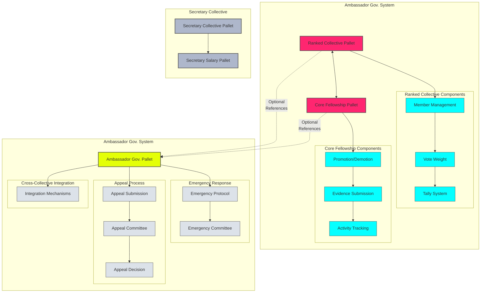

## Rank System Class Diagram

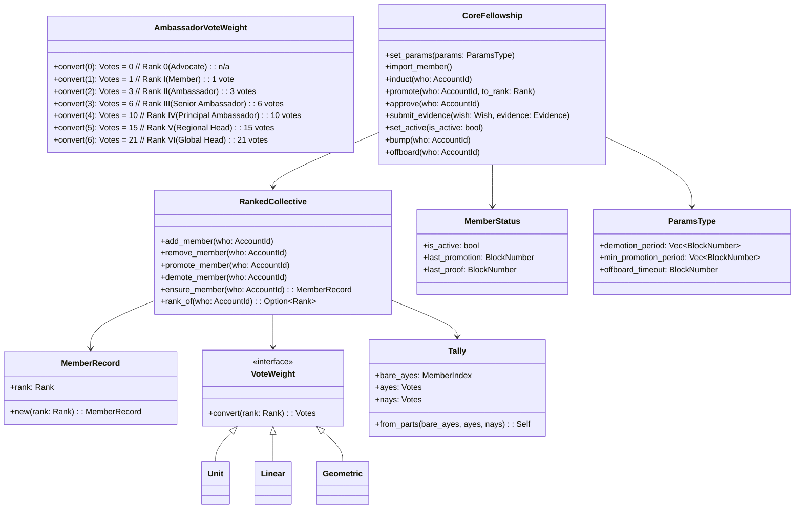

## Onboarding Sequence Diagram

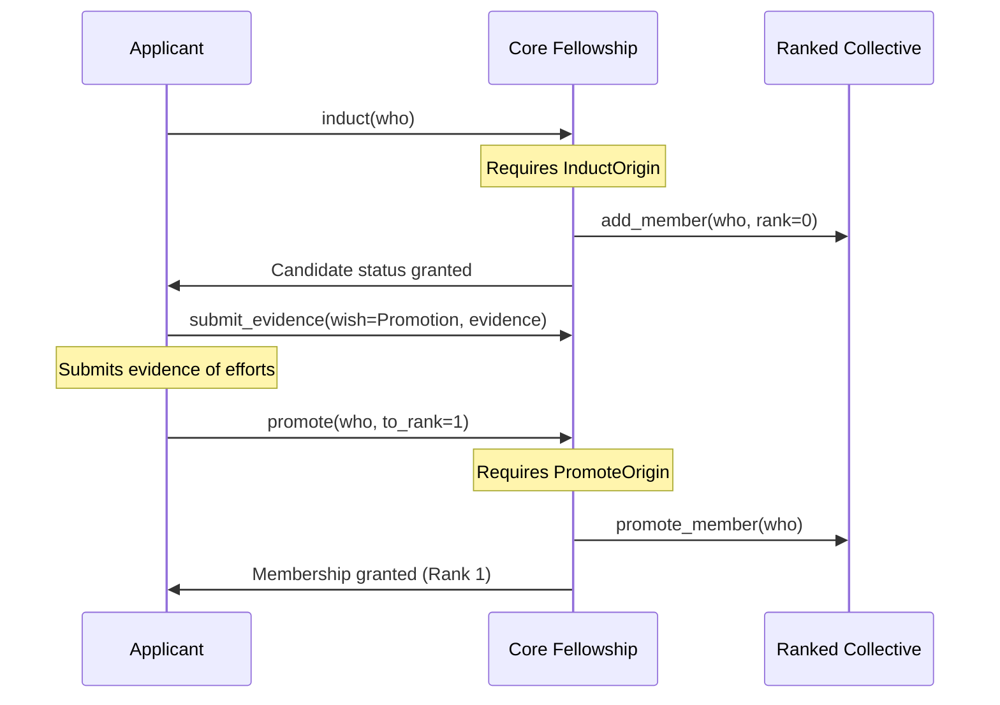

## Promotion Flow Diagram

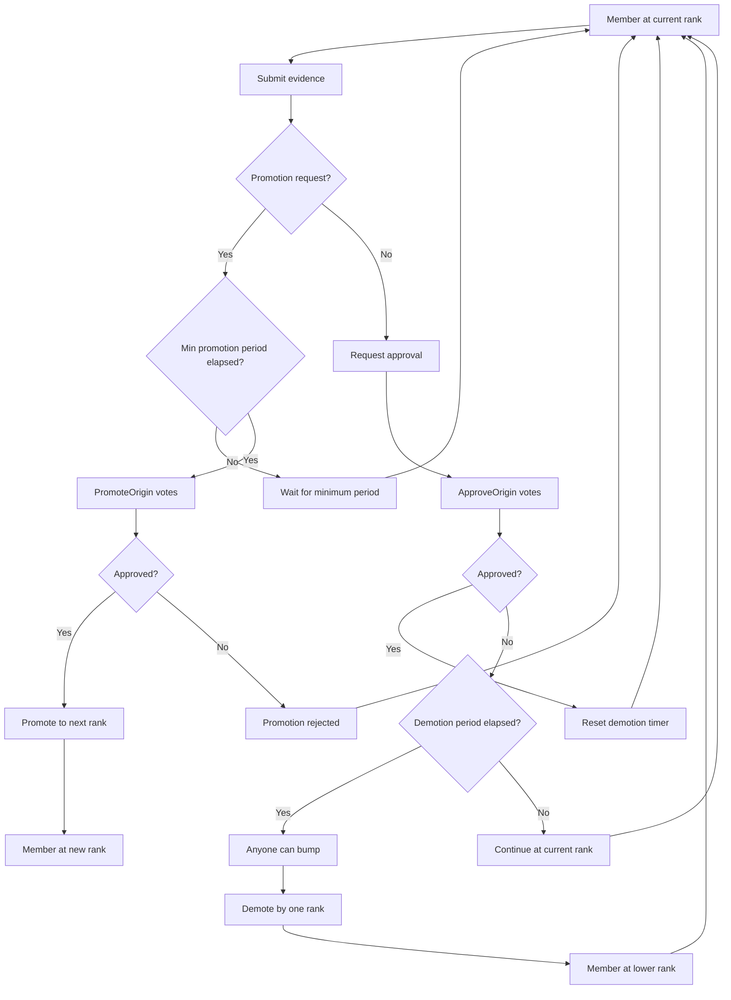

## Data Models

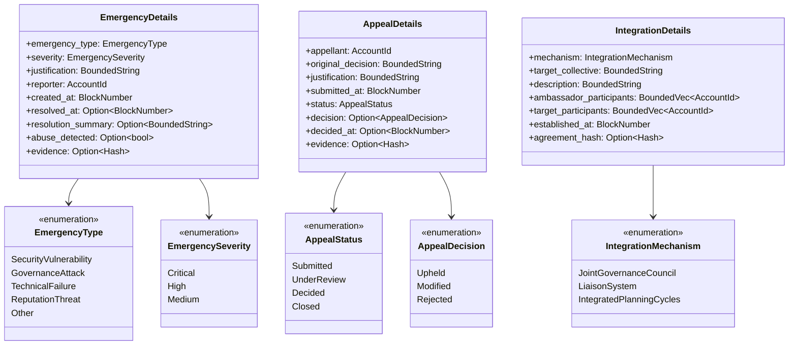

## Ambassador Fellowship Governance Sequence Diagram

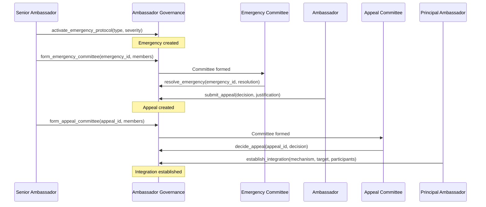

## Secretary Collective Diagram

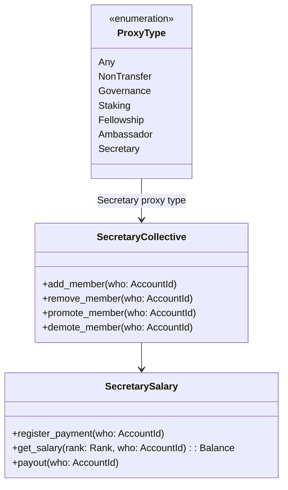

## Decoupled Architecture Diagram

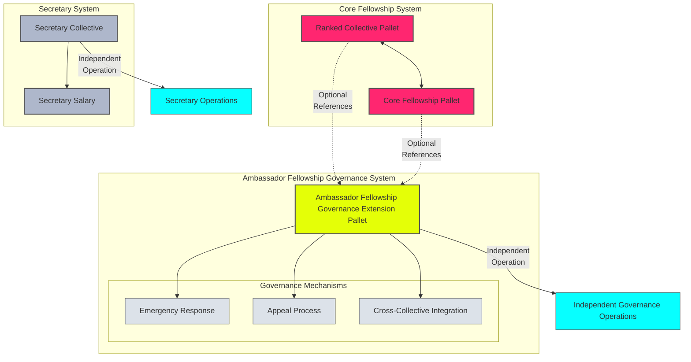

## Ambassador Fellowship Vertical Structure

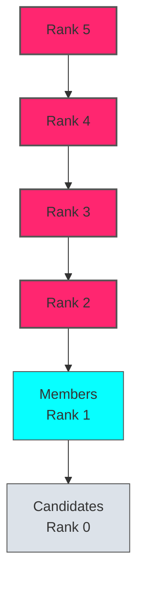

## Decision Making System

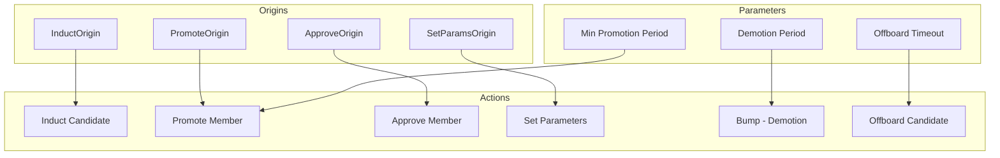

## Ambassador Fellowship Governance Class Diagram

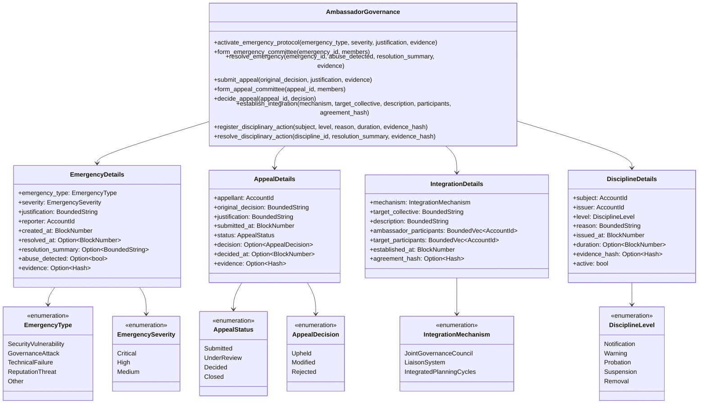

## Professional Services Boundaries

The Ambassador Fellowship Governance pallet includes a Professional Services Boundaries feature that enables the registration and referral of professional service providers. This feature ensures that only verified service providers can be registered and that referrals are created by qualified ambassadors.

### Key Components

- **Identity Verification**: Service providers must have verified identities through the Identity pallet
- **Rank-Based Access Control**: Only ambassadors with sufficient rank can register providers or create referrals
- **Evidence Hashing**: In accordance with the evidence handling pattern of the pallet, evidence hashes are stored on-chain while actual evidence is stored off-chain
- **Transparent Referrals**: Service referrals include compensation disclosure for transparency

### Class Diagram

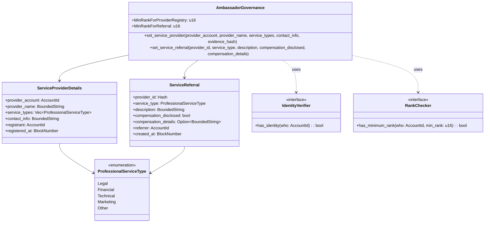

### Sequence Diagram

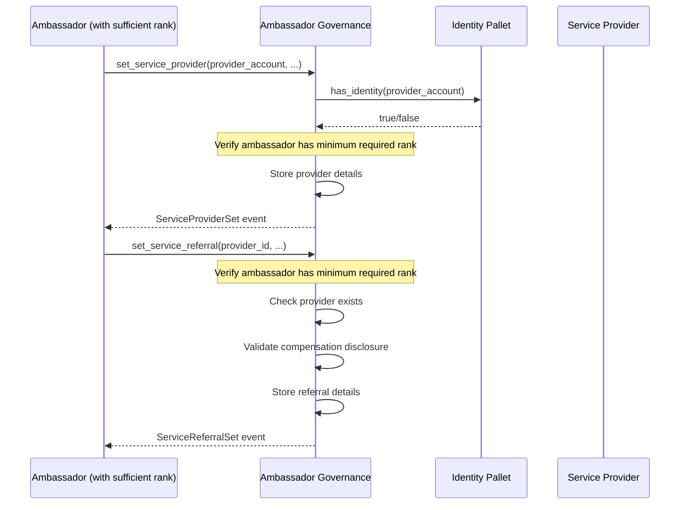

## Disciplinary Action Framework

The Ambassador Fellowship Governance pallet implements a Progressive Enforcement pattern through its Disciplinary Action Framework. This framework enables authorized members to register disciplinary actions against fellowship members who violate the code of conduct or fail to fulfill their responsibilities, and provides a structured path for resolving these actions.

### Key Components

- **Identity Verification**: All disciplinary actions require verified identity through the Identity pallet
- **Rank-Based Access Control**: Only ambassadors with sufficient rank (`MinRankForDisciplinaryActionEnforcement`) can register or resolve disciplinary actions
- **Progressive Enforcement**: Follows a graduated approach (notification → warning → action) with clear remediation paths
- **Evidence Handling**: Follows the pallet's evidence handling pattern where evidence hashes are stored on-chain while actual evidence is stored off-chain
- **Transparency**: All disciplinary actions emit events for transparency and accountability

### Class Diagram

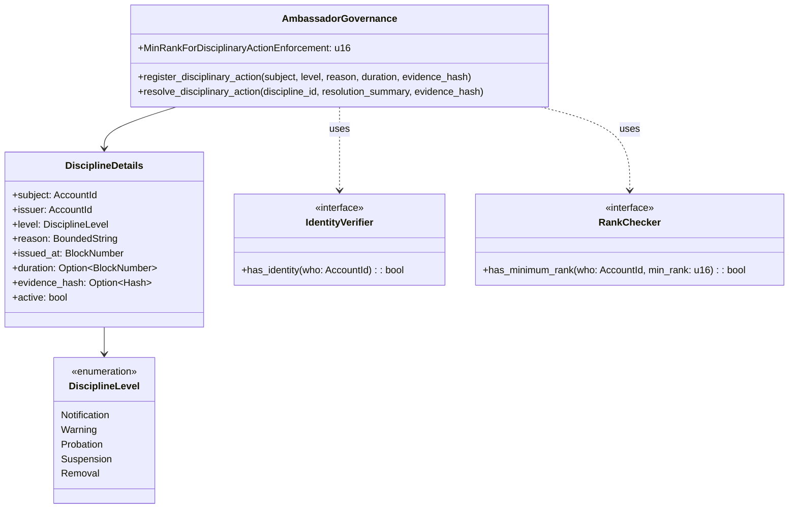

### Sequence Diagram

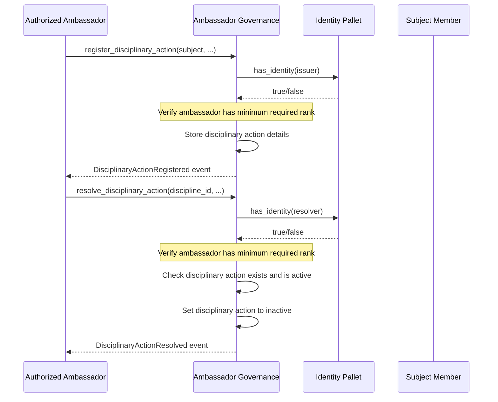

This framework ensures that disciplinary actions follow due process, with clear paths for both enforcement and resolution, aligning with the Ambassador Fellowship Manifesto's governance patterns.
